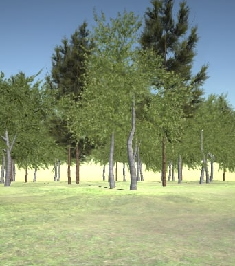

## Scene creation

The scripts here below are used to instantiate/delete the scene, in particular to create a naturalistic environment composed of a green ground with trees at (reachable) distance:

[](plain_forest.jpg)

For the general list: [beam me up, Scotty!](../README.md)

### Ground

Sets the position of the ground: in particular, it defines the position of each of the 9 squares composing the game area. If the player moves beyond a given distance from the center of the game area in a certain direction, the 3 squares behind the player are deleted and 3 squares in front are created.
A method is defined for every direction (`SwapForward()`, `SwapBackward()`, `SwapRight()`, `SwapLeft()`). An example is reported below.

<details>
<summary>Inspect code</summary>
    
```c#
    private void SwapForward()
    {
        //old_grounds
        ground[0] = applied_ground[0];
        ground[1] = applied_ground[1];
        ground[2] = applied_ground[2];

        ground[3] = applied_ground[3];
        ground[4] = applied_ground[4];
        ground[5] = applied_ground[5];

        ground[6] = applied_ground[6];
        ground[7] = applied_ground[7];
        ground[8] = applied_ground[8];


        //new grounds
        applied_ground[0] = ground[6]; // new
        applied_ground[1] = ground[7]; // new
        applied_ground[2] = ground[8]; // new

        applied_ground[3] = ground[0];
        applied_ground[4] = ground[1];
        applied_ground[5] = ground[2];

        applied_ground[6] = ground[3];
        applied_ground[7] = ground[4];
        applied_ground[8] = ground[5];


        applied_ground[0].GetComponent<CreateTreesAndTargets>().deleteGreenery();
        applied_ground[1].GetComponent<CreateTreesAndTargets>().deleteGreenery();
        applied_ground[2].GetComponent<CreateTreesAndTargets>().deleteGreenery();
        applied_ground[0].GetComponent<CreateTreesAndTargets>().createGreenery();
        applied_ground[1].GetComponent<CreateTreesAndTargets>().createGreenery();
        applied_ground[2].GetComponent<CreateTreesAndTargets>().createGreenery();

    }
```
  
</details>

In the `Update()`, the methods for swapping the ground are called whenever a certain change in the player position is detected.

<details>
<summary>Inspect code</summary>
    
```c#
    void Update()
    {
        if (player.transform.localPosition.x > midX + 25 || player.transform.localPosition.x < midX - 25 ||
            player.transform.localPosition.z > midZ + 25 || player.transform.localPosition.z < midZ - 25)
        {
            // Changing the value 40 in midX/midZ +/- 40, will increase/decrease the area beyond which the trigger is caused
            if (player.transform.localPosition.x > midX + 40) { midX += 50; SwapRight(); }
            if (player.transform.localPosition.x < midX - 40) { midX -= 50; SwapLeft(); }
            if (player.transform.localPosition.z > midZ + 40) { midZ += 50; SwapForward(); }
            if (player.transform.localPosition.z < midZ - 40) { midZ -= 50; SwapBackward(); }
            SetGround();
        }

    }

```

**Ground depends on**:
- Createtargetsandtrees.cs - during the ground swap, to delete the trees on the ground areas being removed and to create them on the ground areas being added to the scene.
  
</details>

### SomeGreenery

On application start, instantiates (active and visible) bushes and mushrooms with a random disposition within the ground area (gameObject) that has this script as component. It also provides a method to delete the objects it created.

<details>
<summary>Inspect code</summary>
    
```c#

    public void createGreenery()
    {
        for (int i = 0; i < 100; i++)
        {
            createOneObject(bush1);
            createOneObject(bush2);
            createOneObject(bush3);
            createOneObject(bush4);
            createOneObject(bush5);

            createOneObject(mushroom1);
            createOneObject(mushroom2);
            createOneObject(mushroom3);
        }
    }

    void createOneObject(GameObject Prefab)
    {
        Vector3 pos = new Vector3(Random.Range(-25f, 25f), 0, Random.Range(-25f, 25f));

        Instantiate(Prefab, pos, Quaternion.Euler(0, Random.Range(-180f, 180f), 0), transform);
    }

    public void deleteGreenery()
    {
        foreach (Transform child in transform)
        {
            Destroy(child.gameObject);
        }
    }
```
  
</details>


### Createtargetsandtrees

On application start, instantiates (active and visible) a set of trees with a random disposition within the ground area (gameObject) that has this script as component. It also provides a method to delete the objects it created.

<details>
<summary>Inspect code</summary>
    
```c#
public void createGreenery()
{

    for (int i = 0; i < 2; i++) // here, 48 tree + 8 target obj (commented out)
    {
        createAndSaveObject(tree1, "Obstacle"); 
        createAndSaveObject(tree2, "Obstacle"); 
        createAndSaveObject(tree3, "Obstacle"); 
        createAndSaveObject(tree1, "Obstacle"); 
        createAndSaveObject(tree2, "Obstacle"); 
        createAndSaveObject(tree3, "Obstacle"); 

        createAndSaveObject(tree1, "Obstacle"); 
        createAndSaveObject(tree2, "Obstacle"); 
        createAndSaveObject(tree3, "Obstacle"); 
        createAndSaveObject(tree1, "Obstacle"); 
        createAndSaveObject(tree2, "Obstacle"); 
        createAndSaveObject(tree3, "Obstacle"); 

        createAndSaveObject(tree1, "Obstacle"); 
        createAndSaveObject(tree2, "Obstacle"); 
        createAndSaveObject(tree3, "Obstacle"); 
        createAndSaveObject(tree1, "Obstacle"); 
        createAndSaveObject(tree2, "Obstacle"); 
        createAndSaveObject(tree3, "Obstacle"); 

        createAndSaveObject(tree1, "Obstacle"); 
        createAndSaveObject(tree2, "Obstacle"); 
        createAndSaveObject(tree3, "Obstacle"); 
        createAndSaveObject(tree1, "Obstacle"); 
        createAndSaveObject(tree2, "Obstacle"); 
        createAndSaveObject(tree3, "Obstacle");

        /*createAndSaveObject(lowlevel, "LowTarget");
        createAndSaveObject(midlevel, "MidTarget");
        createAndSaveObject(highlevel, "HighTarget");
        createAndSaveObject(doubleobject, "DoubleTarget");*/
    }

}


void createAndSaveObject(GameObject Prefab, string type)
{
    Vector3 pos = new Vector3(UnityEngine.Random.Range(-25f, 25f), 0, UnityEngine.Random.Range(-25f, 25f));
    GameObject newObject = Instantiate(Prefab, transform.position + pos, Quaternion.Euler(0, UnityEngine.Random.Range(-180f, 180f), 0), transform);
    newObject.tag = type;

    Vector3 position = newObject.transform.position;
    Vector3 rotation = newObject.transform.eulerAngles;
    Vector3 scale = newObject.transform.localScale;

    saver.addObject(
        newObject.GetInstanceID().ToString(),
        type,
        position[0],
        position[1],
        position[2],
        rotation[0],
        rotation[1],
        rotation[2],
        scale[0],
        scale[1],
        scale[2]
        );
}

public void deleteGreenery()
{
    foreach (Transform child in transform)
    {
        if (child.name != "Ground")
        {
            saver.addObjectEnd(child.GetInstanceID().ToString());
            Destroy(child.gameObject);
        }
    }
}

```
  
</details>


### Rocks
